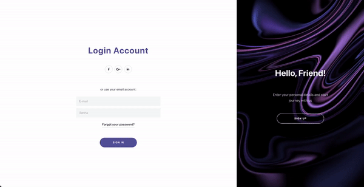

<div align="center">
<h1>SignIn and SignUp Web Animation</h1>


</div>

### Tecnologias

- ReactJS (Typescript)
- JQuery
- Animate.css
- Framer Motion

### Sobre a interface

O efeito de transição sobrepõe o formulário que se altera imperceptivelmente para adequar-se ao novo contexto (de Login para Create Account e vice-versa). O background se mantém estático durante as transições, a verdadeira fluidez desta interface se encontra no efeito elástico do componente que exibe o background ao se deslizar de uma extremidade para outra e nas sutis alterações de textos.



### Iniciando o projeto
Faça o clone do projeto:
  ```
  git clone https://github.com/Igorryan/signin-up-web-animation
  ```

  No diretório do projeto, execute o comando abaixo para instalar as dependências:
  ```
  yarn
  ```

Após a instalação das dependências, execute:
  ```
  yarn start
  ```
Abra [http://localhost:3000](http://localhost:3000) para visualizar o projeto no browser
  <div align="center">
  <sub>Built with ❤︎ by <a href="https://www.linkedin.com/in/igorryan/">Igor Ryan</a>
</div>
